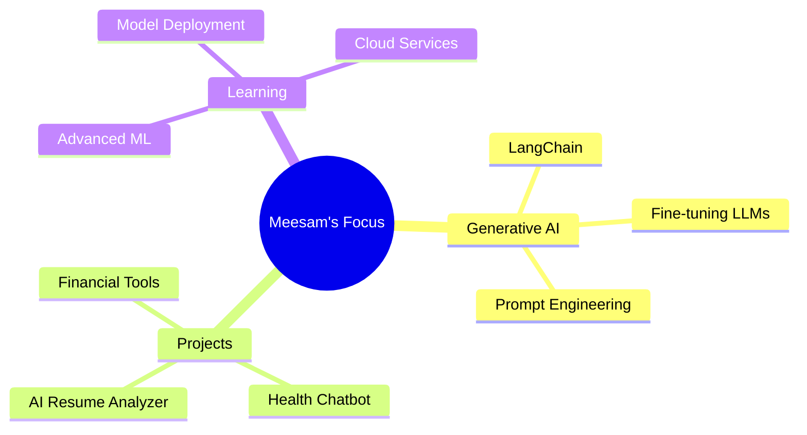

# Hi there, I'm Meesam Raza 👋

<div align="center">
  
</div>

<div align="center">
  <a href="https://linkedin.com/in/meesam-raza"></a>
  <a href="https://github.com/meesam331"></a>
  <a href="https://huggingface.co/meesam"></a>
  <a href="mailto:meesamraza331@gmail.com"></a>
</div>

<div align="center">
  
</div>

<br>

## 💫 About Me


```python
class MeesamRaza:
    def __init__(self):
        self.role = "Data Scientist & AI Developer"
        self.location = "Khairpur, Pakistan"
        self.email = "meesamraza331@gmail.com"
        self.interests = ["LLMs", "Chatbots", "ML Automation"]
    
    def say_hi(self):
        print("Thanks for stopping by! Let's build something amazing 🚀")

me = MeesamRaza()
me.say_hi()
```

🎯 Building AI-powered solutions that solve real-world problems  
💡 Passionate about **LLMs**, **Generative AI**, and **ML Automation**  
📚 Currently exploring advanced **LangChain** and **Fine-tuning techniques**  
🎓 BS Computer Science (5th Semester)

<br>

## 🛠️ Tech Stack

<div align="center">

### Languages


### ML/AI


### Frameworks


### Data Tools


</div>

<br>

## 🚀 Featured Projects

<div align="center">
  <a href="https://github.com/meesam331/ai-resume-analyzer">
    
  </a>
  <a href="https://github.com/meesam331/health-chatbot">
    
  </a>
</div>

<br>

<table>
  <tr>
    <td width="50%">
      <h3>🤖 AI Resume Analyzer</h3>
      <p><strong>Python · LLM APIs · Streamlit</strong></p>
      <p>✅ 30% better ATS keyword matching</p>
      <p>✅ Interactive web deployment</p>
      <p>✅ NLP-powered resume parsing</p>
    </td>
    <td width="50%">
      <h3>🥗 Health & Diet Chatbot</h3>
      <p><strong>Groq API · LLaMA · Hugging Face</strong></p>
      <p>✅ Personalized recommendations</p>
      <p>✅ LLM integration</p>
      <p>✅ Deployed on Hugging Face Spaces</p>
    </td>
  </tr>
  <tr>
    <td width="50%">
      <h3>📊 Financial AI Chatbot</h3>
      <p><strong>Python · Pandas · BCG Simulation</strong></p>
      <p>✅ 10-K report analysis</p>
      <p>✅ Financial query response</p>
      <p>✅ Prototype development</p>
    </td>
    <td width="50%">
      <h3>📈 Data Analysis Projects</h3>
      <p><strong>EDA · Classification · Visualization</strong></p>
      <p>✅ Logistic Regression</p>
      <p>✅ Decision Trees</p>
      <p>✅ Model evaluation</p>
    </td>
  </tr>
</table>

<br>

## 💼 Experience

<div align="center">

| Position | Company | Duration |
|----------|---------|----------|
| **Data Science Intern** | Data Zenix Company | 1 Month |
| **AI/ML Intern** | DevelopersHub Corporation | 6 Weeks |
| **GenAI Virtual Intern** | BCG Simulation | Virtual |

</div>

<br>

## 📜 Certifications

<div align="center">
  


</div>

<br>

## 📊 GitHub Analytics

<div align="center">
  
  
  
</div>

<br>

## 🎯 Current Focus



<br>

## 🌐 Let's Connect!

<div align="center">
  <a href="https://linkedin.com/in/meesam-raza">
    
  </a>
  <a href="https://github.com/meesam331">
    
  </a>
  <a href="mailto:meesamraza331@gmail.com">
    
  </a>
</div>

<div align="center">
  <br>
  
  <br>
  <br>
  
  <br>
  <br>
  <strong>⭐️ From Meesam Raza ⭐️</strong>
</div>
