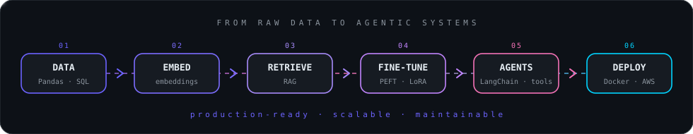
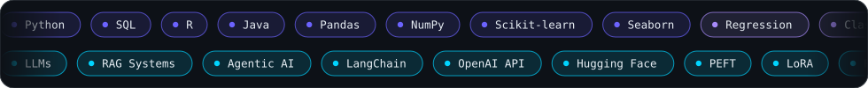

<div align="center">



<a href="https://github.com/meesam331"></a>

<br/>

&nbsp;
&nbsp;
&nbsp;
&nbsp;


<br/><br/>

<a href="https://www.linkedin.com/in/meesam-raza-295701354/"></a>
<a href="https://github.com/meesam331"></a>
<a href="https://huggingface.co/spaces/meesamraza"></a>
<a href="https://portfolio-website-delta-amber-62.vercel.app/"></a>
<a href="mailto:meesamraza331@gmail.com"></a>

<br/>


<br/><br/>



</div>

<div align="center"></div>

<h2 align="center"> About Me</h2>

I'm a **Data Scientist & LLM Application Developer** focused on building production-ready generative and agentic AI systems. My work sits at the intersection of Machine Learning, NLP, and software engineering: designing pipelines that are not just accurate, but scalable, maintainable, and genuinely useful.

<table>
<tr>
<td width="62%" valign="middle">

```python
class MeesamRaza:
    role        = "Data Scientist · GenAI & Agentic AI Dev"
    location    = "Khairpur, Sindh, Pakistan 🇵🇰"

    building    = [
        "RAG-powered conversational agents",
        "AI-driven resume analyzers",
        "Agentic workflows with tool use",
    ]
    learning    = [
        "LangChain LCEL",
        "Multi-agent orchestration",
        "Advanced embeddings",
    ]
    fine_tuning = "LLMs with PEFT & LoRA"
    open_to     = "AI / ML Engineer roles"
    reach_me    = "meesamraza331@gmail.com"
```

</td>
<td width="38%" align="center" valign="middle">

</td>
</tr>
</table>

<div align="center">


</div>

<div align="center"></div>

<h2 align="center"> Impact in Numbers</h2>

<div align="center">


</div>

<div align="center"></div>

<h2 align="center"> Tech Arsenal</h2>

<div align="center">



<br/>

**Languages & Databases**


**Data Science & Machine Learning**


**Generative & Agentic AI**


**Deployment & BI**


</div>

<div align="center"></div>

<h2 align="center"> What I Build</h2>

| Area | What I'm Building |
|:---:|---|
| 🤖 **RAG Chatbots** | Conversational agents grounded in your own documents using Retrieval-Augmented Generation |
| 🕸️ **Agentic AI** | LLM agents that plan, call tools, and orchestrate multi-step workflows |
| 📄 **Resume Analyzers** | NLP + LLM screening tools that match talent with opportunity |
| 🎛️ **LLM Fine-tuning** | Domain-specific models using PEFT and LoRA |
| 📊 **Data Science Pipelines** | End-to-end analysis, feature engineering, and ML modeling workflows |

<div align="center"></div>

<h2 align="center"> Featured Projects</h2>

<table>
<tr>
<td width="50%" valign="top">

**📈 [Sales Signal](https://github.com/meesam331/sales_prediction_app)**

Interactive Flask app that predicts product sales from TV, radio, and newspaper ad budgets using a clear linear regression workflow.

  

</td>
<td width="50%" valign="top">

**🌫️ [Air Quality Index Prediction, Khairpur](https://github.com/meesam331?tab=repositories)**

Regression pipeline using Random Forest and XGBoost, deployed for real-time AQI inference.

  

</td>
</tr>
<tr>
<td width="50%" valign="top">

**💹 [Next-Day Stock Price Prediction](https://github.com/meesam331?tab=repositories)**

Time-series regression model that projects daily market performance, evaluated with RMSE and MAE.

 

</td>
<td width="50%" valign="top">

**🇵🇰 [Unemployment in Pakistan (2000–2023)](https://github.com/meesam331/-unemployment-in-_Pakistan-from-2000-2023)**

Two decades of regional macroeconomic trends explored through interactive heatmaps and visual analytics.

 

</td>
</tr>
<tr>
<td width="50%" valign="top">

**🚗 [Car Price Prediction](https://github.com/meesam331/Car-Price-Prediction-Code-)**

Machine learning regression model that estimates car prices from vehicle features.

 

</td>
<td width="50%" valign="top">

**📧 [Email Spam Detection with ML](https://github.com/meesam331/-Email-Spam-Project-Title-Sales-Predection-2-Detection-With-ML)**

Text classification project that separates spam from legitimate email.

 

</td>
</tr>
</table>

<div align="center">

<a href="https://huggingface.co/spaces/meesamraza"></a>
<a href="https://github.com/meesam331?tab=repositories"></a>

</div>

<div align="center"></div>

<h2 align="center"> Experience</h2>

| Role | Where | Highlights |
|---|---|---|
| **Data Science Intern** | Data Zenix *(Remote)* | Cleaned 10,000+ record datasets and cut missing data by 20% with KNN and mean/median imputation. Automated reports in Python, Pandas, and Seaborn, delivering 3x faster. |
| **AI & ML Intern** | DevelopersHub Corporation *(Remote)* | Built Logistic Regression, Random Forest, and Gradient Boosting classifiers reaching 88% accuracy with GridSearchCV. Used PCA and correlation analysis for feature selection. |
| **GenAI Consulting Virtual Intern** | BCG Simulation *(Remote)* | Prototyped a LangChain + OpenAI chatbot that answers financial questions from 10-K reports, and tuned prompts for accuracy and relevance. |

<div align="center"></div>

<h2 align="center"> Learning Roadmap</h2>

<div align="center">


<br/>


</div>

<div align="center"></div>

<h2 align="center"> GitHub Analytics</h2>

<div align="center">


<br/>


<br/><br/>


</div>

<div align="center"></div>

<h2 align="center"> Certifications</h2>

| Certification | Issuer | Date |
|---|---|---|
| **Google Advanced Data Analytics** (Professional Certificate) | Google / Coursera | Feb 2026 |
| **Google IT Automation with Python** (Professional Certificate) | Google / Coursera | Jan 2026 |
| **Google Prompting Essentials** (Specialization) | Google / Coursera | Sep 2025 |
| **Certified Python Developer** | Government of Sindh · PITP | – |
| **Introduction to Machine Learning** | Microsoft | – |
| **Data Science and Analytics** | HP LIFE | – |
| **Foundations of Business Intelligence** | Google / Coursera | – |

<div align="center"></div>

<h2 align="center"> Let's Connect</h2>

<div align="center">


I'm actively seeking **AI/ML Engineer** opportunities, and always open to discussing AI research, RAG and agentic systems, or collaborating on open-source projects.

<a href="https://www.linkedin.com/in/meesam-raza-295701354/"></a>
<a href="mailto:meesamraza331@gmail.com"></a>

<br/><br/>

<i>"The best way to predict the future is to create it."</i>


</div>
